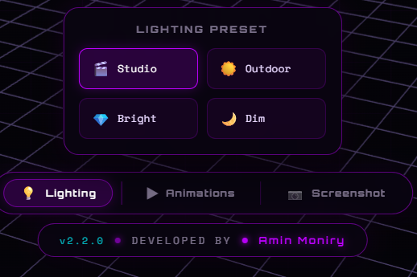

<div align="center">


<br>


</div>

## 🔭 Overview

AminTivanix2 3D Visualizer Engine is a browser-based, standalone 3D model inspection tool built on top of Three.js. The engine enables users to load, inspect, and interact with `.glb` and `.gltf` formatted 3D assets directly within any modern web browser — without the requirement of a server, installation, or external dependencies. All JavaScript libraries are injected inline at build time, producing a single self-contained HTML file that runs offline.

The application targets 3D artists, game developers, product designers, and technical reviewers who require a lightweight, portable solution for real-time 3D asset inspection. The engine supports simultaneous loading of up to seven models, GLTF animation playback, multiple lighting presets, model focus via click interaction, drag-and-drop import, and high-resolution screenshot export — all within a responsive, cyberpunk-aesthetic interface built with Orbitron and Space Mono typography.


## ✨ Features

| Feature | Description | Status |
|---------|-------------|--------|
| Standalone HTML Export | Build script inlines all libraries into a single portable `.html` file | ✅ Complete |
| Multi-Model Loading | Import and display up to 7 `.glb` / `.gltf` models simultaneously | ✅ Complete |
| Drag & Drop Import | Drop model files directly onto the viewport to load them | ✅ Complete |
| OrbitControls Navigation | Smooth orbit, pan, and zoom navigation with damping | ✅ Complete |
| Click-to-Focus | Click any loaded model to smoothly focus the camera on it | ✅ Complete |
| GLTF Animation Playback | Auto-detects embedded animations with a switchable selection panel | ✅ Complete |
| Lighting Presets | Studio, Outdoor, Bright, and Dim presets with one-click switching | ✅ Complete |
| Screenshot Export | Renders and downloads the current viewport as a `.png` file | ✅ Complete |
| Model Management Panel | Named model list with per-model focus and removal controls | ✅ Complete |
| Mobile Responsive Drawer | Full touch-optimized model management drawer for narrow viewports | ✅ Complete |
| Animated Background Grid | Drifting perspective grid with radial vignette for depth effect | ✅ Complete |
| ACES Filmic Tone Mapping | Cinematic tone mapping and sRGB output encoding via Three.js | ✅ Complete |
| Custom Build Pipeline | Python script assembles the template and injects library bundles | ✅ Complete |
| Multi-Model Auto-Layout | Models are spaced and centered automatically after each import | ✅ Complete |


## 🛠️ Tech Stack

| Layer | Technologies |
|-------|-------------|
| 3D Rendering | Three.js r128 (UMD bundle, inlined at build time) |
| Model Loading | GLTFLoader.js — GLTF 2.0 / GLB format support |
| Camera Controls | OrbitControls.js — orbit, pan, zoom with inertia damping |
| Animation System | THREE.AnimationMixer — GLTF embedded clip playback |
| Build Pipeline | Python 3 (`build_viewer.py`) — template injection and assembly |
| UI Typography | Orbitron (display), Space Mono (body) via Google Fonts |
| Tone Mapping | ACES Filmic Tone Mapping with sRGB output encoding |
| Distribution | Single standalone `.html` file — no server or CDN required |


## 🖼️ Screenshots

<div align="center">


*Main viewport — animated placeholder state prior to model import*


*Automotive asset loaded and rendered under Studio lighting preset*


*Component-level inspection using the click-to-focus camera system*

</div>


## 📁 Project Structure

```
3D_Visualizer/
│
├── assets/                          # Preview images for README
│   ├── main.png                     # Viewport idle state screenshot
│   ├── CarModeltest.png             # Car model render sample
│   └── LightPart.png                # Component detail sample
│
├── libs/                            # Bundled Three.js library files
│   ├── three.min.js                 # Three.js core (r128, UMD)
│   ├── GLTFLoader.js                # GLTF/GLB format loader
│   └── OrbitControls.js             # Orbit camera controller
│
├── universal_template.html          # Source template with INJECT_ placeholders
├── build_viewer.py                  # Build script — inlines libs into template
├── AminTivanix2_3D_Visualizer.html  # OUTPUT — final standalone viewer file
├── model.glb                        # Sample 3D model for testing
├── requirements.txt                 # Python dependencies
├── .gitignore
└── LICENSE
```


## ⚙️ Installation

### Option A — Download the Pre-Built Release (Recommended)

The `AminTivanix2_3D_Visualizer.html` file is distributed as a self-contained release. No installation or server is required.

1. Navigate to the [Releases](https://github.com/Amin-Moniry/3D_Visualizer/releases) page.
2. Download `AminTivanix2_3D_Visualizer.html` from the latest release.
3. Open the downloaded file in any modern web browser (Chrome, Firefox, Edge).
4. Import a `.glb` or `.gltf` model using the **Import Model** button or drag and drop.

---

### Option B — Build from Source

**Prerequisites:** Python 3.8 or higher.

#### Windows

```bat
git clone https://github.com/Amin-Moniry/3D_Visualizer.git
cd 3D_Visualizer
pip install -r requirements.txt
python build_viewer.py
```

#### Linux / macOS

```bash
git clone https://github.com/Amin-Moniry/3D_Visualizer.git
cd 3D_Visualizer
pip3 install -r requirements.txt
python3 build_viewer.py
```

The build script reads `universal_template.html`, inlines the contents of `libs/three.min.js`, `libs/GLTFLoader.js`, and `libs/OrbitControls.js` at their respective `INJECT_` placeholders, and writes the final standalone output to `AminTivanix2_3D_Visualizer.html`.


## 📖 Usage

1. Open `AminTivanix2_3D_Visualizer.html` in a modern web browser.
2. Click **Import Model** (top-right button) or drag and drop a `.glb` / `.gltf` file onto the viewport to load a model.
3. Navigate the scene using the mouse: **left-click drag** to orbit, **right-click drag** to pan, **scroll wheel** to zoom.
4. Click any loaded model directly in the viewport to focus the camera on it; click empty space to return to the full scene view.
5. Use the **Lighting** button in the bottom toolbar to switch between Studio, Outdoor, Bright, and Dim presets.
6. Use the **Animations** button to view and switch between any embedded GLTF animation clips.
7. Click **Screenshot** in the bottom toolbar to download the current viewport as a `.png` file.
8. Use the model list panel (left side on desktop, drawer on mobile) to focus or remove individual models.

---

### ⚠️ Preparing Your Model in Blender

To ensure models are displayed correctly in the visualizer, the following steps are required when exporting from Blender:

1. **Use the Principled BSDF shader** for all materials. The GLTF exporter only supports PBR-compatible material nodes.
2. **In the Shading workspace**, verify that all texture maps (Base Color, Roughness, Metallic, Normal) are connected correctly to a Principled BSDF node. Unsupported node trees will not export correctly.
3. **Set the color space** of non-color textures (Roughness, Metallic, Normal) to **Non-Color** in Blender's Image Texture node to avoid incorrect rendering.
4. **Export format:** Go to `File → Export → glTF 2.0 (.glb/.gltf)` and select **GLB** (binary, single file) for maximum compatibility.
5. Under export options, enable **Apply Modifiers**, **Include Animations**, and **Export Materials**.
6. The engine uses **ACES Filmic Tone Mapping** and **sRGB output encoding** — models exported with correct PBR materials will render accurately without additional adjustment.


## 🗺️ Roadmap

- [ ] HDR environment map (HDRI) support for image-based lighting
- [ ] Per-model transform controls (position, rotation, scale handles in viewport)
- [ ] Wireframe toggle and normal map visualization overlay
- [ ] Background color and environment customization panel
- [ ] Model measurement tools (bounding box dimensions display)
- [ ] Annotation system — attach labels to model surfaces
- [ ] Export selected model back to GLB from within the viewer
- [ ] Turntable auto-rotation mode with configurable speed
- [ ] VR / WebXR mode for headset-based inspection
- [ ] Drag-and-drop texture replacement on loaded materials


## 🤝 Contributing

1. Fork the repository via the **Fork** button on GitHub.
2. Create a dedicated feature branch: `git checkout -b feature/your-feature-name`
3. Commit changes with a descriptive message: `git commit -m "Add: brief description of change"`
4. Push the branch to your fork: `git push origin feature/your-feature-name`
5. Open a Pull Request against the `master` branch of this repository.

All derivative works, forks, and distributions must retain the original program name **AminTivanix2 3D Visualizer Engine** and credit **Amin Moniry** as the Original Author, as specified in the LICENSE file. Subsequent contributors must be listed strictly as Contributors and may not claim sole ownership of the core engine.


## 📄 License

This project is distributed under the **MIT License** with an additional mandatory attribution requirement.

Any derivative works, modifications, forks, or distributions must prominently retain the original program name **AminTivanix2 3D Visualizer Engine** and credit **Amin Moniry** as the Original Author and Publisher. Subsequent developers or modifiers must be listed strictly as Contributors or Subsequent Developers and may not claim sole ownership of the core engine.

See the [LICENSE](LICENSE) file for the complete license text.

© 2026 Amin Moniry (AminTivanix2) — All Rights Reserved


## 📬 Contact

<div align="center">

| Channel | Link |
|---------|------|
| 📧 Email | [amintivanix2@gmail.com](mailto:amintivanix2@gmail.com) |
| 💻 GitHub | [Amin-Moniry](https://github.com/Amin-Moniry) |
| 📱 Telegram | [@amintivanix2](https://t.me/amintivanix2) |
| 🌐 Website | [allin1wrench.ir](https://allin1wrench.ir) |
| 🐛 Issues | [GitHub Issues](https://github.com/Amin-Moniry/3D_Visualizer/issues) |

</div>


<div align="center">


</div>
