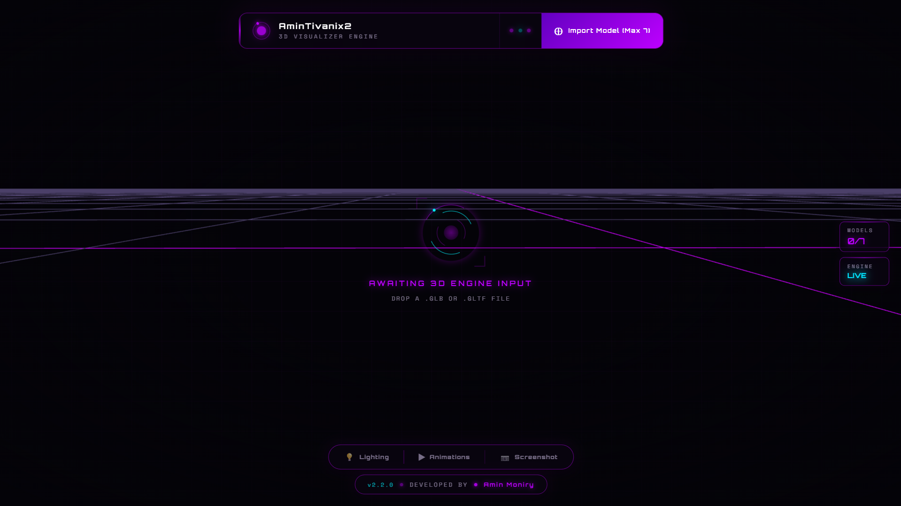
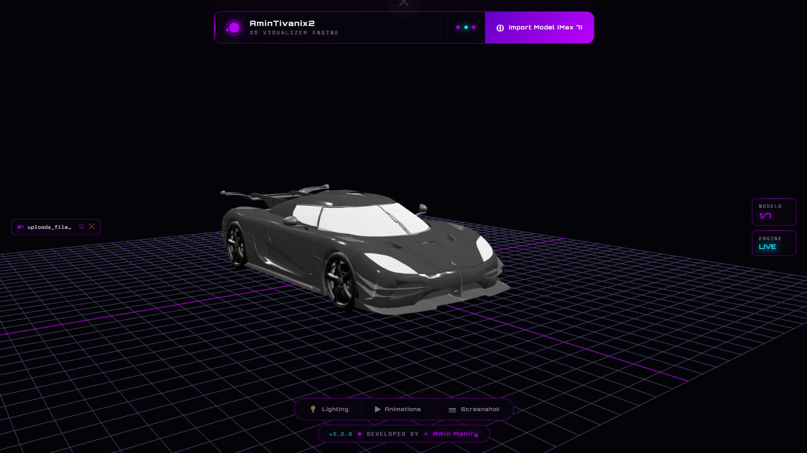

<div align="center">


<br/>


<br/>

<a href="https://github.com/Amin-Moniry/3D_Visualizer/releases"></a>
<a href="LICENSE"></a>
<a href="https://github.com/Amin-Moniry/3D_Visualizer"></a>
<a href="https://github.com/Amin-Moniry/3D_Visualizer"></a>
<a href="https://github.com/Amin-Moniry/3D_Visualizer/stargazers"></a>

<br/><br/>


</div>

---

<div align="center">

## `◈` Overview

</div>

<div align="center">

AminTivanix2 3D Visualizer Engine is a browser-based, standalone 3D model inspection tool built on Three.js. The engine enables users to load, inspect, and interact with `.glb` and `.gltf` formatted 3D assets directly within any modern web browser — without the requirement of a server, installation, or external dependencies. All JavaScript libraries are injected inline at build time, producing a single self-contained HTML file that runs fully offline.

The application targets 3D artists, game developers, product designers, and technical reviewers who require a lightweight, portable solution for real-time 3D asset inspection. The engine supports simultaneous loading of up to seven models, GLTF animation playback, multiple lighting presets, model focus via click interaction, drag-and-drop import, and high-resolution screenshot export — all within a responsive cyberpunk-aesthetic interface built with Orbitron and Space Mono typography.

</div>

<br/>


---

<div align="center">

## `◈` Features

</div>

<div align="center">

| `▶` Feature | Description | Status |
|:-----------:|:-----------:|:------:|
| **Standalone HTML Export** | Build script inlines all libraries into a single portable `.html` file | ✅ Complete |
| **Multi-Model Loading** | Import and display up to 7 `.glb` / `.gltf` models simultaneously | ✅ Complete |
| **Drag & Drop Import** | Drop model files directly onto the viewport to load them | ✅ Complete |
| **OrbitControls Navigation** | Smooth orbit, pan, and zoom navigation with damping | ✅ Complete |
| **Click-to-Focus** | Click any loaded model to smoothly lerp the camera onto it | ✅ Complete |
| **GLTF Animation Playback** | Auto-detects embedded animations with a switchable selection panel | ✅ Complete |
| **Lighting Presets** | Studio, Outdoor, Bright, and Dim presets with one-click switching | ✅ Complete |
| **Screenshot Export** | Renders and downloads the current viewport as a `.png` file | ✅ Complete |
| **Model Management Panel** | Named model list with per-model focus and removal controls | ✅ Complete |
| **Mobile Responsive Drawer** | Full touch-optimized model management drawer for narrow viewports | ✅ Complete |
| **Animated Background Grid** | Drifting perspective grid with radial vignette for depth effect | ✅ Complete |
| **ACES Filmic Tone Mapping** | Cinematic tone mapping and sRGB output encoding via Three.js | ✅ Complete |
| **Custom Build Pipeline** | Python script assembles the template and injects library bundles | ✅ Complete |
| **Multi-Model Auto-Layout** | Models are spaced and centered automatically after each import | ✅ Complete |

</div>

<br/>


---

<div align="center">

## `◈` Tech Stack

</div>

<div align="center">

| Layer | Technologies |
|:-----:|:------------:|
| **3D Rendering** | Three.js r128 — UMD bundle, inlined at build time |
| **Model Loading** | GLTFLoader.js — GLTF 2.0 / GLB binary format |
| **Camera Controls** | OrbitControls.js — orbit, pan, zoom with inertia damping |
| **Animation System** | THREE.AnimationMixer — GLTF embedded clip playback |
| **Build Pipeline** | Python 3 · `build_viewer.py` — template injection and assembly |
| **UI Typography** | Orbitron · Space Mono — via Google Fonts |
| **Tone Mapping** | ACES Filmic · sRGB output encoding |
| **Distribution** | Single standalone `.html` — no server or CDN required |

</div>

<br/>


---

<div align="center">

## `◈` Screenshots

</div>

<div align="center">



*`▶` Engine idle state — animated hologram placeholder prior to model import*

<br/>



*`▶` Automotive asset rendered under Studio lighting with OrbitControls active*

</div>

<br/>


---

<div align="center">

## `◈` Project Structure

</div>

<div align="center">

```
3D_Visualizer/
│
├── assets/                           # Preview images for README
│   ├── main.png                      # Viewport idle state screenshot
│   └── CarModeltest.png              # Car model render sample
│
├── libs/                             # Bundled Three.js library files
│   ├── three.min.js                  # Three.js core (r128, UMD)
│   ├── GLTFLoader.js                 # GLTF / GLB format loader
│   └── OrbitControls.js              # Orbit camera controller
│
├── universal_template.html           # Source template with INJECT_ placeholders
├── build_viewer.py                   # Build script — inlines libs into template
├── AminTivanix2_3D_Visualizer.html   # ► OUTPUT — final standalone viewer
├── model.glb                         # Sample 3D model for testing
├── requirements.txt                  # Python dependencies
├── .gitignore
└── LICENSE
```

</div>

<br/>


---

<div align="center">

## `◈` Installation

</div>

<div align="center">

### `▲` Option A — Download Pre-Built Release `(Recommended)`

The `AminTivanix2_3D_Visualizer.html` file is distributed as a self-contained release.
No installation, server, or internet connection is required after download.

</div>

1. Navigate to the [**Releases**](https://github.com/Amin-Moniry/3D_Visualizer/releases) page.
2. Download `AminTivanix2_3D_Visualizer.html` from the latest release.
3. Open the file in any modern web browser — Chrome, Firefox, or Edge.
4. Import a `.glb` or `.gltf` model via the **Import Model** button or drag and drop.

<br/>

<div align="center">

### `▲` Option B — Build from Source

**Prerequisite:** Python 3.8 or higher

</div>

**Windows**

```bat
git clone https://github.com/Amin-Moniry/3D_Visualizer.git
cd 3D_Visualizer
pip install -r requirements.txt
python build_viewer.py
```

**Linux / macOS**

```bash
git clone https://github.com/Amin-Moniry/3D_Visualizer.git
cd 3D_Visualizer
pip3 install -r requirements.txt
python3 build_viewer.py
```

<div align="center">

The script reads `universal_template.html`, inlines `three.min.js`, `GLTFLoader.js`, and `OrbitControls.js` at their `INJECT_` placeholders, and writes the final output to `AminTivanix2_3D_Visualizer.html`.

</div>

<br/>


---

<div align="center">

## `◈` Usage

</div>

<div align="center">

1. Open `AminTivanix2_3D_Visualizer.html` in a modern web browser.
2. Click **Import Model** (top-right) or drag and drop a `.glb` / `.gltf` file onto the viewport.
3. Navigate the scene — **left-click drag** → orbit · **right-click drag** → pan · **scroll wheel** → zoom.
4. Click any model directly in the viewport to smoothly focus the camera on it; click empty space to return to full scene view.
5. Use the **Lighting** button in the bottom toolbar to switch between Studio, Outdoor, Bright, and Dim presets.
6. Use the **Animations** button to view and switch between any embedded GLTF animation clips.
7. Click **Screenshot** in the bottom toolbar to export the current viewport as a `.png` file.

</div>

<br/>

<div align="center">

### `◈` Model Panel — Managing Loaded Models

</div>

<div align="center">

After importing, each model appears as a named entry in the **model list panel** (left side on desktop · slide-up drawer on mobile via the `📦 Models` button).

Each entry contains two action buttons:

</div>

<div align="center">

| Button | Symbol | Action |
|:------:|:------:|:------:|
| **Focus** | `◎` | Smoothly zooms the camera onto that specific model in the viewport |
| **Remove** | `✕` | Removes the model from the scene and frees the slot |

</div>

<div align="center">

> `▶` Tap `◎` to isolate and inspect any individual model — the camera lerps directly to it.
> Tap `✕` to permanently remove a model from the scene. Up to **7 models** can be loaded simultaneously.
> On mobile, open the drawer via **`📦 Models`** in the bottom toolbar to access these controls.

</div>

<br/>

<div align="center">

### `⚠` Preparing Your Model in Blender

</div>

<div align="center">

For correct rendering in the engine, follow these export steps in Blender:

</div>

<div align="center">

| Step | Action |
|:----:|:------:|
| **1** | Use **Principled BSDF** for all materials — the GLTF exporter only supports PBR nodes |
| **2** | In the **Shading** workspace, connect Base Color, Roughness, Metallic, and Normal maps to Principled BSDF |
| **3** | Set Roughness, Metallic, and Normal texture color space to **Non-Color** |
| **4** | Export via `File → Export → glTF 2.0` and select **GLB** (single binary file) |
| **5** | Enable **Apply Modifiers**, **Include Animations**, and **Export Materials** in export settings |
| **6** | The engine applies **ACES Filmic Tone Mapping** — PBR materials will render accurately without adjustment |

</div>

<br/>


---

<div align="center">

## `◈` Roadmap

</div>

<div align="center">

- [ ] HDR environment map (HDRI) support for image-based lighting
- [ ] Per-model transform gizmos — position, rotation, and scale handles in viewport
- [ ] Wireframe toggle and normal map visualization overlay
- [ ] Background color and environment customization panel
- [ ] Model measurement tools — live bounding box dimension display
- [ ] Annotation system — attach text labels to model surfaces
- [ ] Export selected model back to GLB from within the viewer
- [ ] Turntable auto-rotation mode with configurable speed
- [ ] VR / WebXR mode for headset-based inspection
- [ ] Drag-and-drop texture replacement on loaded materials

</div>

<br/>


---

<div align="center">

## `◈` Contributing

</div>

<div align="center">

1. Fork the repository via the **Fork** button on GitHub.
2. Create a feature branch: `git checkout -b feature/your-feature-name`
3. Commit with a descriptive message: `git commit -m "Add: brief description"`
4. Push to your fork: `git push origin feature/your-feature-name`
5. Open a **Pull Request** against the `master` branch of this repository.

All derivative works must retain the name **AminTivanix2 3D Visualizer Engine** and credit **Amin Moniry** as Original Author per the LICENSE terms. Contributors may not claim sole ownership of the core engine.

</div>

<br/>


---

<div align="center">

## `◈` License

This project is distributed under the **MIT License** with a mandatory attribution clause.

Any forks, modifications, or distributions must prominently retain the name **AminTivanix2 3D Visualizer Engine** and credit **Amin Moniry** as the Original Author and Publisher. See [LICENSE](LICENSE) for the complete terms.

`©` 2026 Amin Moniry (AminTivanix2) — All Rights Reserved

</div>

<br/>


---

<div align="center">

## `◈` Contact

<br/>


<br/>

[](mailto:amintivanix2@gmail.com)

[](https://github.com/Amin-Moniry)

[](https://t.me/amintivanix2)

[](https://allin1wrench.ir)

[](https://github.com/Amin-Moniry/3D_Visualizer/issues)

</div>

<br/>


<div align="center">

<br/>


<br/>


</div>
